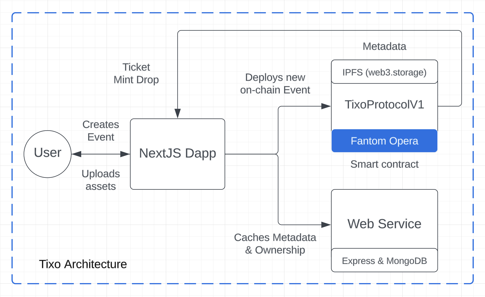

# TIXO: Next-Generation Ticketing on Aurora

This project was built for the Encode Club Aurora Hackathon, specifically for the Aurora Tokenization and Entertainment, Digital Media, and NFTs Challenges.

View the full demo walkthrough here: https://vimeo.com/838419544

Learn more about the Tixo Protocol V1 here: [Tixo Protocol](/contracts/)

Learn more about the Tixo API Server here: [Tixo API](/server/)

## Issue we face in ticketing today

The current ticketing market is fundamentally flawed, with numerous instances of fans being duped, artists fighting fraud, and exorbitant ticket prices due to scalpers and bots. The root cause of this inefficiency lies in the black-box fee and ownership model employed by centralized ticketing companies, which obscures the fair value of tickets, their legitimacy, and allows for huge, unmerited profits. This non-transparent system serves those profiting from the status quo, which includes event organizers who choose outdated ticketing technologies that enable a vibrant secondary market to exist, and facilitate non-transparent business models. It's imperative to remove this "black box" nature and establish an open and transparent record of value flows in the ticketing market. Blockchain offers a promising solution to these issues, fostering transparency and accountability in ticket sales, and enabling consumers to make informed decisions.

## What is TIXO

TIXO is a revolutionary Web3 decentralized ticketing platform, purpose-built to redefine connections between artists, venues, promoters, and fans at live events. Our groundbreaking platform harnesses the power of blockchain technology to increase the profitability of events for organizers and artists through audience ownership, loyalty, and ticket resale.

As the future of live event ticketing, TIXO provides a seamless, branded ticketing marketplace that not only elevates the profitability of events through programmatic sponsorship and ticket resale ownership, but also enhances the artist and fan experience with easy-to-use loyalty tools. It empowers organizers, artists, and venues to connect with their audience more intimately, ensuring authenticity and traceability of tickets while maximizing convenience for the user, who can purchase using traditional credit card payments and fiat payouts.

## Features on TIXO today

- Event ticketing creation tool for hosts
- Token-gated private event ticketing
- UI Customized for ticketing pages
- Mobile-first ticket purchase flow with multi-payments
- Payment integration with aETH and Stripe API
- QR code powered ticket verification process
- Event monitoring dashboard for tracking purchases
- Custodial and non-custodial ticket vault solutions

## How we built it
- Frontend: NextJS, Chakra UI, RainbowKit, wagmi hooks

- Payment Rails: Aurora ETH (crypto), Stripe API (fiat)

- Server: ExpressJS, Hardhat, Web3.Storage Stripe API

## What's next for TIXO

We want to build the next-generation event ticketing platform powered by Aurora Network. Some next step features we want to integrate into our application are the following:
- Build React-Native mobile app for v2 prototype
- Tiered ticket sales (i.e. VIP, General Admissions)
- Seating selection for large venue events
- Add ERC-20 payment method for token communities on Aurora
- Add advanced metrics for host event dashboard
- Marketing and partnerships to beta test platform launch
- Export custodial ticket accounts via private key export

## Market opportunity in ticketing

In a rapidly growing online ticketing economy projected to reach $68 billion by 2025, TIXO leads the innovation, offering a more consumer-friendly, transparent, and profitable method of ticketing live events. TIXO provides an unparalleled payment processing experience that's tailored to its needs, reinforcing its credibility as an early player in the Web3 landscape. The integration is smooth, secure, and hassle-free, complete with real-time fraud detection mechanisms that safeguard transaction flows.

TIXO, grounded in advanced Web3 technology, delivers a trusted and familiar user experience, creating a seamless ticketing ecosystem where fans feel they're buying tickets directly from the artists. With TIXO, creators take control, fans gain authentic experiences, and live events become more profitable - welcome to the future of live event ticketing.

## Note on Hackathon Bounties
Aurora Tokenization Challenge: We believe the tokenization of event tickets presents an innovative way to secure, manage and trade tickets. It not only mitigates counterfeiting and fraud risks through immutable blockchain technology, but also enhances ticket traceability, ensuring rightful ownership. Through smart contracts, tokenized tickets allow for dynamic pricing and customizable resale rules, thereby preventing exorbitant reselling prices. Additionally, these tokens enable frictionless peer-to-peer transactions, fostering a more efficient secondary market. Importantly, they offer improved data transparency and audience insights, creating the potential for personalized user experiences. Thus, tokenization of event tickets is a significant leap towards a more secure, user-centric event industry, which is why it's so critical to build a smooth UX platform like Tixo to facilitate this thesis.

Aurora Entertainment, Digital Media, and NFTs Challenges: Tixo secures data privacy and intellectual property through blockchain technology. Patrons purchase unique tokenized tickets, ensuring rightful ownership and combating counterfeit. Artist commissions can be encoded into smart contracts, ensuring transparent, instant payments upon ticket sale. Any resale triggers automated commission payouts, discouraging middlemen fee scalping. Simultaneously, anonymous yet verifiable audience data analytics enhance user experiences while respecting privacy. Tixo, through Aurora, revolutionizes the event industry, addressing its prevalent challenges.